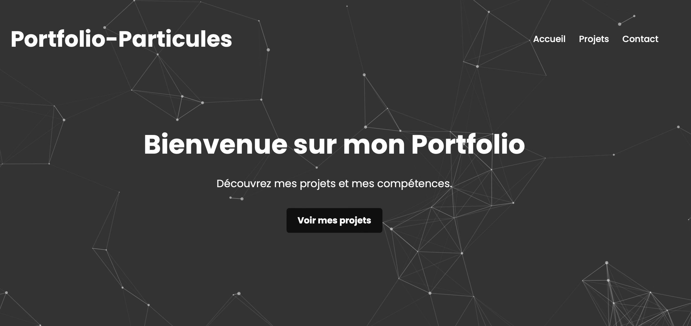

# Portfolio-Particules

Un portfolio impressionnant et dynamique utilisant `particles.js` pour afficher un fond animé de particules. Idéal pour les développeurs, les designers et les professionnels créatifs qui souhaitent montrer leurs compétences et leurs travaux de manière élégante.

## Fonctionnalités

- **Fond animé de particules**: Offre un visuel accrocheur et moderne à votre portfolio.

## Comment l'utiliser ?

1. Clonez le repo.
2. Ouvrez `index.html` dans votre navigateur.

## Personnalisation

- Changement du fond de particules: Modifiez les configurations dans main.js pour personnaliser l'apparence des particules.
- Mise à jour du contenu: Éditez le fichier index.html pour ajouter votre propre contenu, liens et détails de projet.

## Contribution

Si vous avez des suggestions ou des améliorations, n'hésitez pas à ouvrir une issue ou à soumettre une pull request. Toutes les contributions sont les bienvenues!